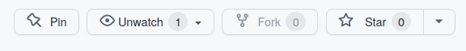
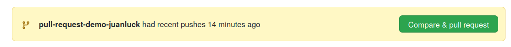
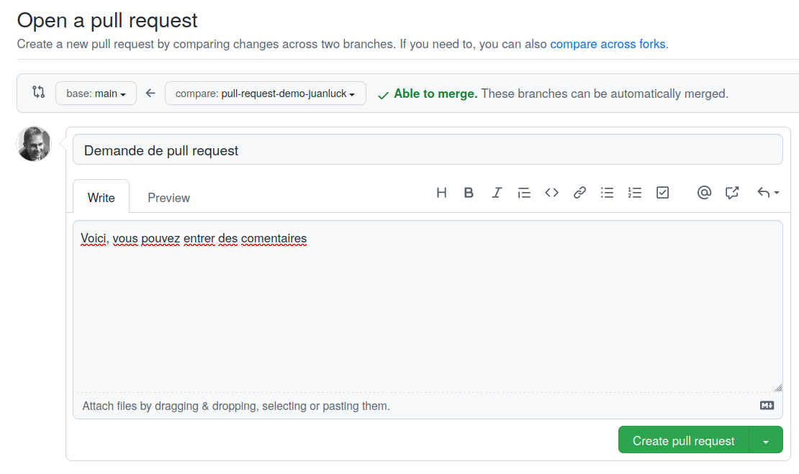
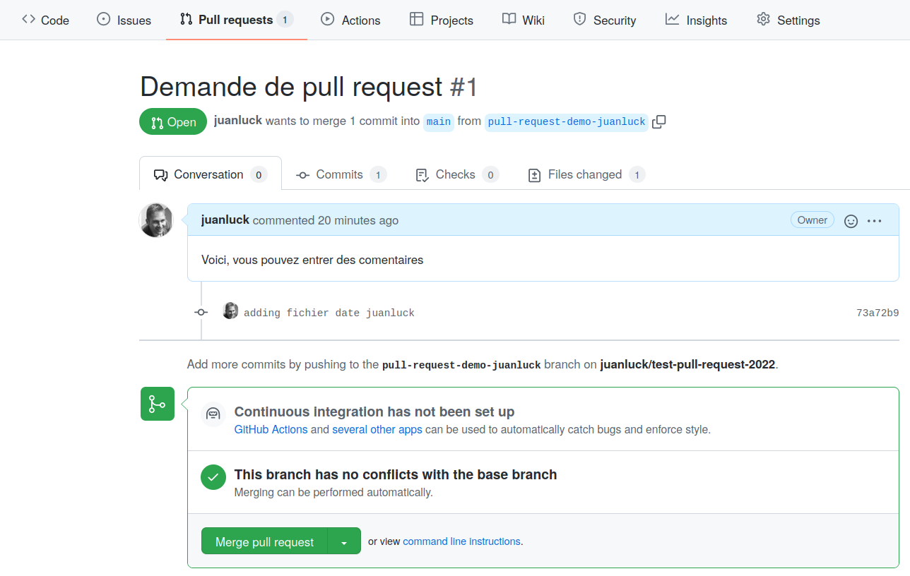

# test-pull-request-2022

Référentiel pour tester la pull request du cours [Introduction à la gestion de version à l’aide de git](https://juanluck.github.io/Introduction-GIT/).

## Instructions pour faire une pull request 

### 1. Faire un fork du référentiel actuel 

- Accéder à ce référentiel https://github.com/juanluck/test-pull-request-2022
- Cliquez sur `fork` en haut à droite de github. 



- Le fork vous permet de copier ce référentiel sur votre compte github. Désormais, vous pouvez travailler avec cette copie du référentiel original. Cela va vous permetre d'expérimenter librement et faire des modifications sans affecter le projet d'origine (celui dans le compte `juanluck`). 

- Voir qu'après le `fork`, vous avez une copie du référentiel dans votre propre espace `https://github.com/<votre_utilisateur>/test-pull-request-2022`

- Créez un nouveau répertoire sur votre machine local (que vous pouvez appeler par exemple `tp4`) et clonez le référentiel depuis votre compte :

```shell
$ ls
tp1 tp2 tp3 
$ mkdir tp4
$ ls
tp1 tp2 tp3 tp4
$ cd tp4
$ git clone git@github.com:<votre_utilisateur>/test-pull-request-2022.git
...
$ cd test-pull-request-2022
```

- Voila, vous avez déjà une copie locale sur votre machine. **Attention !!**, n'apportez pas encore de modifications. Pour effectuer de tels changements, nous allons travailler avec une branche dans la section suivante. 

### 2. Création d'une branche thématique 

Au lieu d'apporter des modifications au répertoire sur la branche `main` par défaut, nous allons travailler sur une nouvelle branche pour effectuer ces modifications.

- Pour créer une branche, utilisez la commande suivante depuis le repertoire `test-pull-request-2022` :

```shell
$ git checkout -b <new-branch-name> 
```
- Où `<new-branch-name>` est le nom de la branche que nous allons appeler : `pull-request-demo-<votre_utilisateur>`

- Pour vérifier que l'espace de travail est bien sur la nouvelle branche (et non sur la branche `main`) tapez :

```shell
$ git branch
  main
* pull-request-demo-<votre_utilisateur>
```
- L'étoile * indique la branche sur laquelle vous travaillez. Désormais les modifications n'affectent que cette branche. Assurez-vous que cette branche est bien `pull-request-demo-<votre_utilisateur>`

- La branche créée appartient à votre référentiel local, mais le référentiel distant n'en a pas encore connaissance. Pour synchroniser les changements entre le référentiel local et distant, écrivez la commande : 

```shell
$ git push origin pull-request-demo-<votre_utilisateur>
```
- A partir de maintenant nous allons faire quelques modifications sur cette branche.

### 3. Modifications sur la branche thématique `pull-request-demo-<votre_utilisateur>`

En principe, nous pourrions apporter n'importe quel changement à partir de maintenant. Cependant, pour éviter de futurs conflits lorsque nous ferons la pull request sur [le réferentiel d'origin](https://github.com/juanluck/test-pull-request-2022), nous allons vous proposer de travailler sur un répertoire exclusif personnalisé et chiffré. 

- Sous linux, la commande `shasum` permet d'obtenir le hash (checksum) de n'importe quelle chaîne de caractères ou fichier. Par example :

```shell
$ echo "John Smith" | shasum
8d0ed1ffa6ba0f6e6cbb74534b4785a916d73ec0
```
- Ce hash `8d0ed1ffa6ba0f6e6cbb74534b4785a916d73ec0` correspond exclusivement à la chaîne "John Smith". Vous pouvez répéter ladite commande et vérifier qu'elle correspond audit code. Si nous modifions légèrement la chaîne de caractères, ce code changera complètement. Essayez, par exemple, avec "Johny Smith".

- Pour obtenir un code crypté qui vous est propre, vous pouvez exécuter la commande avec votre nom et prénom : 

```shell
$ echo "<Votre Prénom> <Votre Nom>" | shasum
<hash de votre nom>
```
- Copiez dans le presse-papier votre code de hachage `<hash de votre nom>`

- Construisons un répertoire avec ce code de hachage et laissons notre filigrane. Pour ce faire, nous nous placerons d'abord sur le répertoire `pr_users` :

```shell
$ cd pr_users
$ mkdir <hash de votre nom>
$ cd <hash de votre nom>
```
- Ensuite, nous pouvons créer un simple fichier texte avec la date et l'utilisateur qui l'a créé en filigrane :

```shell
$ echo "Fichier crée par <votre_utilisateur> le $(date)" > filigrane.txt
```
- Nous n'avons qu'à synchroniser les modifications localement (`git status`,`git add`, `git commit`) et synchroniser la branche avec le répertoire distant (`git push`). Pour rappel, ces modifications ont été apportées à la branche  `pull-request-demo-<votre_utilisateur>`

### 4. Faire une pull request 

Maintenant que les données d'une nouvelle branche ont été poussées vers github, nous pouvons voir qu'une nouvelle option apparaît sur github : 



- Il suffit de cliquer sur Compare & pull request pour initier une pull request.

- Lors de la création d'une `pull request`, vous devrez remplir plusieurs options. Une image similaire à la suivante doit apparaître à l'écran : 



- Bien que l'image puisse être un peu différente dans votre cas, l'idée d'une `pull request` est de demander à l'utilisateur du référentiel d'origine (`juanluck`) d'accepter les modifications apportées dans votre branche. Pour cela, assurez-vous que en `base` apparaît `main:juanluck` (destination de votre requête) et en `compare` la branche où vous avez effectué vos modifications (origine de votre requête). Vous pouvez également ajouter des comentaires et ensuite cliquez sur `Create pull request`.

- **Toutes nos félicitations!!** Vous venez de faire votre première pull request. Maintenant, tout ce que vous avez à faire est d'avoir un peu de patience pour que `juanluck` accepte les modifications sur le référentiel d'origine. Cette pratique que nous venons d'effectuer est la manière standard de collaborer dans un référentiel open source. 

### 5. Accepter une pull request 

Cette pratique est conçue pour initier une pull request. Cependant, dans cette section, nous allons montrer comment nous pouvons accepter une demande de ce type. Si vous souhaitez vous entraîner à la création et à l'acceptation de pull requests, il vous suffit de répéter les étapes précédentes avec le référentiel d'un collègue ou même avec votre propre référentiel (pas besoin de faire un `fork` dans ce cas puisque le dépôt vous appartient. ). 

- Dans le menu github en haut, vous pouvez voir l'option `Pull request`, qui permet de visualiser toutes les requêtes ouvertes de ce type. 

- Dans le cas de cet exercice, il n'y a qu'une seule requête ouverte de ce type dont vous pouvez voir les détails ci-dessous. Les différents onglets : `Conversation`, `commits`,`files changed` permettent d'analyser la demande avant de l'accepter. Il ne reste plus, si vous êtes satisfait, qu'à cliquer sur le bouton vert `Merge pull request`. **Voilà les modifications ont été incorporées dans le référentiel source.**




amogus sus sus in the real life he he he ha
